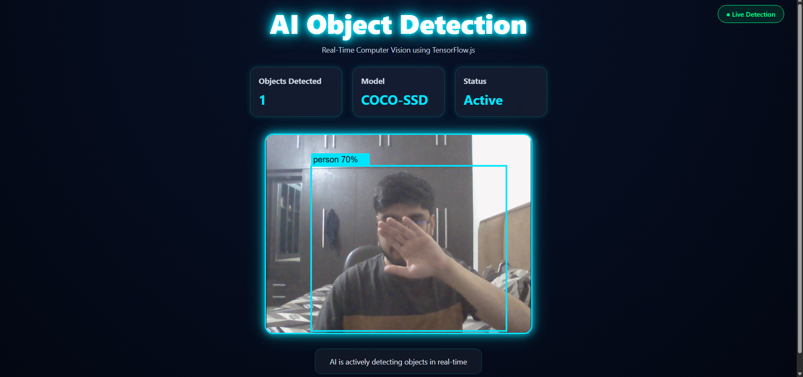

# 🤖 AI Object Detection

A modern real-time Object Detection Web Application built using React.js, TensorFlow.js, and the COCO-SSD model. The application uses a webcam feed to detect and classify objects in real time, displaying bounding boxes and confidence scores with an interactive AI-themed dashboard.

---

## 📸 Project Preview

### Dashboard



### Object Detection Demo


---

## 🚀 Features

* Real-time Object Detection using Webcam
* COCO-SSD Deep Learning Model Integration
* Bounding Box Visualization
* Confidence Score Display
* Interactive AI Dashboard UI
* TensorFlow.js Browser-Based Inference
* Live Detection Status Indicator
* Responsive and Modern Interface

---

## 🛠️ Tech Stack

### Frontend

* React.js
* JavaScript (ES6+)
* HTML5
* CSS3

### Machine Learning

* TensorFlow.js
* COCO-SSD Object Detection Model

### Additional Libraries

* React Webcam

---

## 📂 Project Structure

```text
AI-Object-Detection/
│
├── public/
│
├── screenshots/
│   ├── dashboard.png
│   └── detection-demo.png
│
├── src/
│   ├── App.js
│   ├── App.css
│   ├── utilities.js
│   └── index.js
│
├── package.json
├── package-lock.json
└── README.md
```

---

## ⚙️ Installation

### Clone Repository

```bash
git clone https://github.com/your-username/AI-Object-Detection.git
```

### Navigate to Project Directory

```bash
cd AI-Object-Detection
```

### Install Dependencies

```bash
npm install
```

### Start Development Server

```bash
npm start
```

The application will run at:

```text
http://localhost:3000
```

---

## 🧠 How It Works

1. Webcam captures live video feed.
2. TensorFlow.js loads the COCO-SSD model.
3. The model analyzes each frame.
4. Detected objects are classified.
5. Bounding boxes and confidence scores are drawn on the canvas.
6. Results are displayed in real time on the dashboard.

---

## 🎯 Example Detections

The model can detect objects such as:

* Person
* Bottle
* Chair
* Laptop
* Keyboard
* Mouse
* Cell Phone
* Book
* Backpack
* Cup
* Monitor

and many more objects from the COCO dataset.

---

## 🔮 Future Improvements

* YOLOv8 Integration
* Object Counting
* FPS Counter
* Detection History
* Face Detection
* Custom Model Training
* Performance Optimization
* Detection Analytics Dashboard

---

## 📷 Screenshots

### Main Dashboard


### Live Object Detection


---

## 👨‍💻 Author

**Kartikey Gupta**

MCA Student | AI & Full Stack Development Enthusiast

GitHub: https://github.com/Kartikey-kg

LinkedIn: https://www.linkedin.com/in/kartikey-gupta-74b5b02a0/

---

## ⭐ Support

If you found this project useful, consider giving it a star ⭐ on GitHub.
